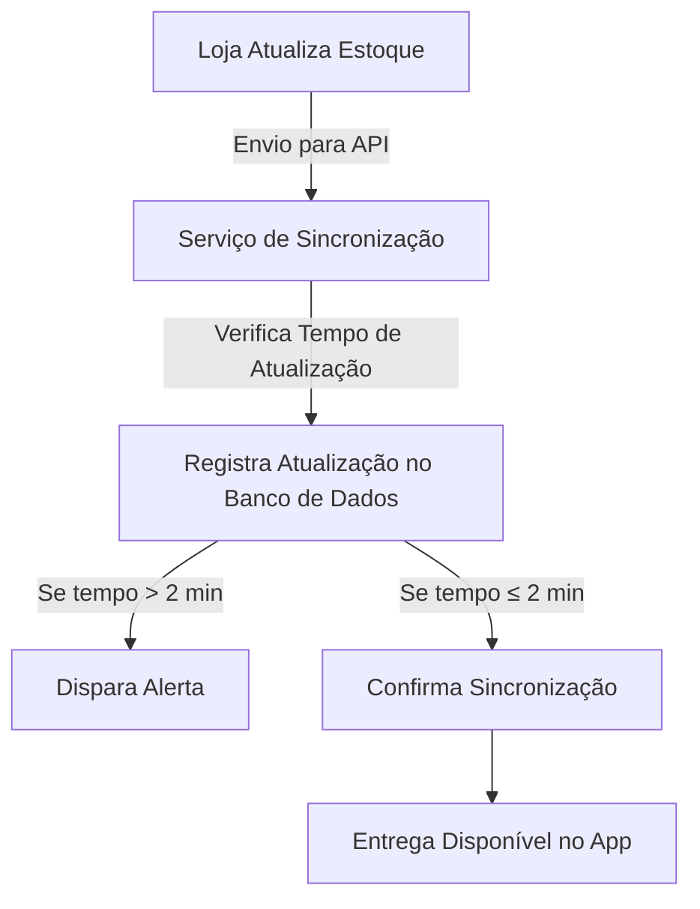
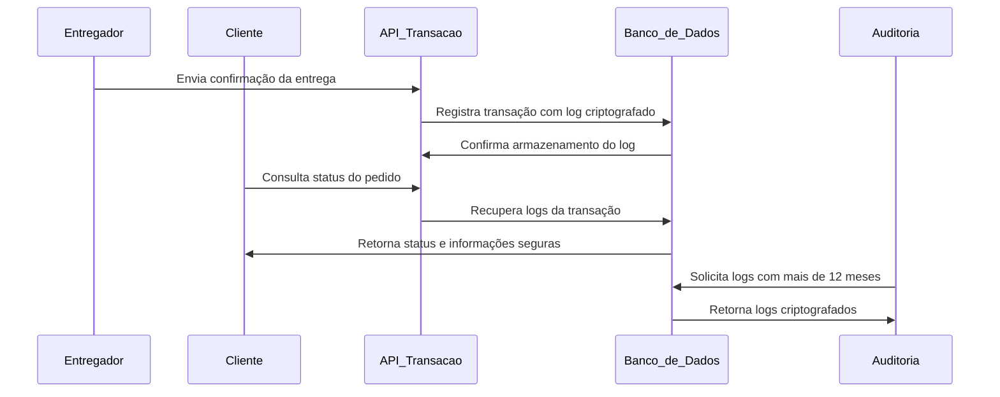

## **1. Mapa dos Business Drivers**  

### **Business Driver 1 (DN2) - Sincronização de Estoque**  
- **Requisito:** 95% das lojas devem ter atualização de estoque a cada 2 minutos, garantindo um tempo máximo de atualização de itens em 10 segundos.  
- **Objetivo:** Evitar que entregadores aceitem pedidos de produtos esgotados, reduzindo cancelamentos, insatisfação do cliente e evitando confusões.  
- **Métrica de Qualidade:** O sistema deve monitorar a taxa de sincronização e gerar alertas para lojas que não atingirem o limite estabelecido.  

### **Business Driver 2 (DN3) - Segurança e Rastreabilidade**  
- **Requisito:** 99% das transações devem ser registradas com logs criptografados, assinaturas digitais e retenção mínima de 12 meses.  
- **Objetivo:** Garantir a integridade e rastreabilidade de operações, protegendo entregadores contra disputas injustas e fraudes.  
- **Métrica de Qualidade:** O sistema deve garantir que cada transação tenha um log correspondente assinado e criptografado, verificável por auditoria.  


## **2. Estratégia e Massa de Testes**

### **Testes para DN2 - Sincronização de Estoque**
```gherkin
Feature: Sincronização de Estoque

  Scenario: Atualização de estoque dentro do tempo esperado
    Given uma loja com estoque atualizado corretamente
    When a sincronização ocorre a cada 2 minutos
    Then o tempo máximo de atualização de itens deve ser 10 segundos
    And a taxa de conformidade deve ser igual ou superior a 95%

  Scenario: Falha na sincronização
    Given uma loja com sincronização atrasada
    When o tempo de atualização excede 2 minutos
    Then um alerta deve ser gerado para a equipe responsável

  Scenario: Teste de carga para sincronização
    Given 1000 lojas enviando atualizações simultaneamente
    When a carga aumenta abruptamente
    Then o sistema deve manter a taxa de sincronização mínima de 95%
```

### **Testes para DN3 - Segurança e Rastreabilidade**
```gherkin
Feature: Segurança e Rastreabilidade das Transações

  Scenario: Registro correto de logs
    Given um pedido foi realizado com sucesso
    When a transação é processada
    Then um log criptografado deve ser gerado
    And a assinatura digital deve ser válida

  Scenario: Tentativa de manipulação de logs
    Given um log registrado corretamente
    When um usuário tenta alterar o conteúdo do log
    Then o sistema deve detectar a alteração
    And rejeitar a modificação

  Scenario: Auditoria de retenção de logs
    Given um log de transação registrado há 11 meses
    When uma auditoria é realizada
    Then o log ainda deve estar disponível no sistema
    And deve estar criptografado e íntegro
```

## **3. Diagramação do Processo com MermaidChart**

### **Fluxo de Sincronização de Estoque**


### **Fluxo de Registro e Auditoria de Logs**



## **Conclusão**
A entrega da **Sprint 1** está estruturada para garantir a documentação e a aferição de qualidade dos requisitos DN2 e DN3.  

1. **Mapa do Business Drivers** – Explica os direcionadores de negócio e as métricas de sucesso.  
2. **Estratégia e Massa de Testes** – Define os testes automatizados usando **Gherkin notation**.  
3. **Diagramação** – Utiliza **MermaidChart** para visualizar os processos de sincronização e rastreamento de transações.  

## **Conclusão**  

A documentação e os testes elaborados garantem que os processos críticos da Rappi, como sincronização de estoque e rastreamento seguro das transações, sejam monitorados e validados de forma automatizada. Com isso, conseguimos estruturar um sistema que assegura maior confiabilidade para os entregadores, reduzindo falhas operacionais e proporcionando um suporte mais eficiente para reduzir os churn dos entregadores.

A sincronização de estoque permite que os entregadores tenham informações precisas sobre a disponibilidade dos produtos, evitando frustrações e cancelamentos. Já a rastreabilidade das transações garante segurança tanto para os entregadores quanto para os clientes, protegendo as operações contra disputas indevidas.

Os testes definidos seguem um padrão estruturado e claro, garantindo que as regras de negócio sejam verificadas continuamente. A modelagem com **MermaidChart** permite uma visão detalhada do fluxo das operações, facilitando futuras iterações e melhorias.

Em nosso projeto em grupo, abordaremos todos os **cinco direcionadores de negócio (DNs)**. Além da **sincronização de estoque (DN2)** e da **segurança e rastreabilidade (DN3)** descritos nessa atividade, o projeto completo também será construido em volta de:  

- **Tempo máximo de resposta a chamados (DN1)** – Garantir que casos críticos sejam respondidos rapidamente, mantendo altos padrões de suporte.  
- **Cancelamentos de pedidos (DN4)** – Implementar regras claras para minimizar impactos financeiros aos entregadores.  
- **Atendimento automatizado (DN5)** – Desenvolver soluções automatizadas para suporte eficiente e disponível 24/7.  
